# MISJustice Alliance Firm

> **The MISJustice Alliance AI-agent legal advocacy, research, publishing, and public-engagement platform.**

[](LICENSE)
[](https://github.com/MISJustice-Alliance/misjustice-alliance-firm)
[](https://github.com/NemoGuard/openclaw)
[](https://github.com/NousResearch/hermes-agent)
[](https://www.mempalace.tech)
[](https://github.com/NVIDIA/OpenShell)
[](https://n8n.io)

---

MISJustice Alliance Firm is an advanced, AI-native legal research and advocacy engine that combines large-scale, machine-driven analysis with human-in-the-loop safeguards at every critical stage of advice, drafting, and escalation. It is designed as a protective, anonymizing layer for MISJustice Alliance's network of professional volunteer attorneys and advocates from institutional retaliation, as well as allowing people to seek help and explore their options without exposing unnecessary identity or case details. All workflows are governed by codified review policies and ethical guardrails so that any output touching real-world disputes, rights, or remedies is validated for accuracy, jurisdictional fit, and adherence to the highest professional and ethical legal standards before it ever reaches a human client, public scrutiny, or court-facing channel.

## Table of Contents

1. [Project Overview](#1-project-overview)
2. [Platform Mission](#2-platform-mission)
3. [Agent Roles and Capabilities](#3-agent-roles-and-capabilities)
4. [Human-in-the-Loop Governance](#4-human-in-the-loop-governance)
5. [Control Interface Layer](#5-control-interface-layer)
6. [Search and Retrieval Architecture](#6-search-and-retrieval-architecture)
   - [6.1 Legal Data Source & Agent Access Layer](#61-legal-data-source--agent-access-layer)
7. [Agent Memory Architecture](#7-agent-memory-architecture)
8. [Case Management Backend](#8-case-management-backend)
9. [Example Workflow Diagram](#9-example-workflow-diagram)
10. [System Architecture Diagram](#10-system-architecture-diagram)
11. [Repository Structure](#11-repository-structure)
12. [Getting Started](#12-getting-started)
13. [Security and Privacy Model](#13-security-and-privacy-model)
14. [Project Resources and Links](#14-project-resources-and-links)
15. [Contributing](#15-contributing)
16. [Disclaimer](#16-disclaimer)

---

## 1. Project Overview

**MISJustice Alliance Firm** is a multi-agent AI operating environment designed to support the MISJustice Alliance — an anonymous legal research and advocacy collective focused on constitutional rights, civil rights enforcement, prosecutorial and police misconduct, legal malpractice, and institutional abuse across Montana and Washington State jurisdictions.

This repository defines the architecture, agent role definitions, prompt policies, workflow orchestration, service integrations, and deployment configuration for the MISJustice Alliance AI agent firm. The platform translates raw evidence, case materials, and legal research into actionable advocacy outputs: vetted internal analysis, litigation-ready chronologies, external referral packets, published case files, and sustained public communications.

The system is built for **serious, mission-critical work** — not a demo or toy project. Every architectural decision is made with the following constraints in mind:

- Strict operational security, anonymity, and data classification.
- Human oversight at every decision gate that touches publication, external communication, or case strategy.
- Role-based access and search isolation so agents only see what their function requires.
- A clean separation between legal research and education (what this platform does) and individualized legal advice (what it must never do).

---

## 2. Platform Mission

The MISJustice Alliance Firm platform is the operational backbone of MISJustice Alliance's research, advocacy, and public communications work. It is designed to:

- **Centralize intake and case development** across multiple matters, jurisdictions, and recurring actors (victims, officers, prosecutors, shelter staff, courts).
- **Automate structured legal research** — statute and case law retrieval, chronology building, § 1983 and malpractice analysis, pattern-of-practice identification — while keeping humans in control of conclusions and strategy.
- **Produce litigation-ready outputs** — case chronologies, issue maps, element matrices, and referral packets — for use by outside attorneys and civil rights organizations.
- **Publish vetted advocacy materials** to public web properties (misjusticealliance.org, the YWCA of Missoula GitBook) with proper redaction, sourcing, and SEO/GEO treatment.
- **Manage sustained public communications** across social platforms (X, Bluesky, Reddit, Nostr, and others) to maximize the reach of investigative findings and reform advocacy.
- **Enforce strict, layered privacy** through role-based data access, tiered document classification, private search tokens, end-to-end encryption, and comprehensive audit logging.

---

## 3. Agent Roles and Capabilities

The MISJustice Alliance Firm operates a modular multi-agent staff. Each agent is a defined role with a bounded scope, allowed tool set, and search permission tier. All agents operate under the OpenClaw / NemoClaw orchestration layer, interact with humans through the **Hermes** interface, carry persistent cross-session memory via **MemoryPalace**, and execute tool calls inside **OpenShell** sandboxes governed by declarative YAML policies.

### Agent Role Table

| Role | Facing | Core Purpose | Key Capabilities | Primary Tools / Services |
|---|---|---|---|---|
| **Hermes — Human Interface & Control** | Human-facing | Primary human interaction surface; delegates to OpenClaw; spawns subagents | Natural-language task intake, operator approvals, subagent spawning, self-evolution via Skill Factory, Hermes CLI/TUI | Hermes Agent, OpenClaw, NemoClaw, MemoryPalace, n8n, Telegram, Discord, iMessage |
| **Orchestrator** | Internal | Central task routing, delegation, and multi-agent control | Multi-agent dispatch, task queuing, human escalation, interface bridging, dynamic subagent spawning | OpenClaw / NemoClaw, OpenShell sandboxes, MemoryPalace, Hermes |
| **Avery — Intake & Evidence** | Internal | Structured intake creation, evidence ingestion, and document triage | Intake forms, OCR/classification, document hashing, MCAS record creation | MCAS API, Chandra OCR, OpenRAG, SearXNG (internal-safe), MemoryPalace |
| **Mira — Telephony & Messaging** | Internal | Call and message handling, Tier-2 summarization | Call transcription, message parsing, triage notes, MCAS event creation | Telephony bridge, AgenticMail, MCAS API, MemoryPalace |
| **Rae — Paralegal Researcher** | Internal | Legal research, chronology drafting, element matrices | Statute/case retrieval, chronology assembly, referral support, citation building | AutoResearchClaw, OpenRAG, LawGlance, **Legal Source Gateway**, SearXNG (internal + public_legal), MCAS, MemoryPalace |
| **Lex — Senior Analyst** | Internal | Legal theory, QA, risk analysis, pattern-of-practice review | Issue mapping, § 1983 / malpractice analysis, draft verification, pattern flagging | AutoResearchClaw, OpenRAG, LawGlance, **Legal Source Gateway**, SearXNG (restricted), MCAS, Open Notebook, MemoryPalace |
| **Iris — PI / Public Records Researcher** | Internal | Public-official and institutional investigation | OSINT, cross-jurisdiction research, public-record retrieval, actor/agency linking | AutoResearchClaw, SearXNG (pi-tier), MCAS, OpenRAG, MemoryPalace |
| **Atlas — Case Lifecycle Coordinator** | Internal | End-to-end case lifecycle orchestration and deadline management | Status tracking, SOL/deadline management, agent workflow sequencing, milestone HITL triggers | MCAS API (status fields), Open Notebook, n8n webhooks, MemoryPalace |
| **Veritas — Internal Integrity Monitor** | Internal (Compliance) | Continuous audit of agent behavior, data flows, and policy adherence | Agent monitoring, data classification audit, violation detection, audit trail generation | Platform audit log (read-only), n8n webhooks, Open Notebook, local/ollama |
| **Chronology Agent** | Internal | Event-to-timeline assembly | MCAS event reading, narrative ordering, reliability tagging, litigation-ready output | MCAS API, OpenRAG, Open Notebook, MemoryPalace |
| **Citation / Authority Agent** | Internal | Source verification for all analytical outputs | Fetch-and-verify, citation checking, primary authority cross-reference | SearXNG (public_legal), OpenRAG, LawGlance, **Legal Source Gateway** (citation-lookup, cases.search) |
| **Casey — Counsel Scout** | Bridge | External counsel and org research, referral packet assembly | Firm/attorney research, bar lookups, MCAS export, referral memo drafting | SearXNG (restricted + osint_public), MCAS export API, Open Notebook, MemoryPalace |
| **Ollie — Outreach Coordinator** | Bridge | Drafting and routing external outreach messages | Template-based outreach drafts, AgenticMail approval queues, MCAS logging | AgenticMail, MCAS API, SearXNG (internal-safe) |
| **Webmaster** | Bridge → External | All public web properties: misjusticealliance.org, YWCA GitBook, future sites | Publication pipeline, redaction checks, SEO/GEO, sitemap management, GitBook curation | Open WebUI, GitBook API, SearXNG (public-safe), CMS/static site tools |
| **Social Media Manager** | External | Public brand, platform presence, and content distribution | Platform posting, campaign sequencing, audience monitoring, reputation management | X, Bluesky, Reddit, Nostr connectors; Open Notebook; OpenClaw scheduling |
| **Sol — Public Content QA** | Bridge → External | Final QA gate before any content reaches public web or social platforms | Fact-check, source verification, citation accuracy, redaction spot-check, QA report generation | SearXNG (public-safe), OpenRAG (public-safe view), MCAS public exports, Open Notebook |
| **Quill — GitBook Curator** | Bridge → External | Structure and maintain the YWCA of Missoula GitBook case file library | Document organization, index maintenance, cross-linking, public-safe export | GitBook API, MCAS exports, SearXNG (public-safe), Open Notebook |
| **Vane — Operator Search Interface** | Internal (Human-facing) | Conversational AI answering UI for human operator ad-hoc research over the private SearXNG instance | Cited web Q&A, multi-mode research (Speed / Balanced / Quality), document upload & Q&A, image/video search, domain-scoped queries, search history | Vane UI, SearXNG (T4-admin token via `SEARXNG_API_URL`), Ollama / local LLM, Open Notebook (output) |

> **Note on Hermes:** Hermes is the **primary human-facing interface** for the entire platform. Operators interact with the agent stack through Hermes' CLI/TUI, which translates natural-language commands into OpenClaw task dispatches. Hermes also supports **self-evolution**: its built-in Skill Factory allows the platform to create, test, and load new agent skills as capabilities and workflows expand — without requiring a full redeployment. OpenClaw and NemoClaw may also use Hermes to **spawn transient subagents** for parallelized tasks that don't require a persistent named agent role. See [Section 5](#5-control-interface-layer) for the full interface model.

> **Note on MemoryPalace:** Every agent with a persistent role (Avery, Mira, Rae, Lex, Iris, Atlas, Casey, and others) uses **MemoryPalace** as its cross-session memory substrate. MemoryPalace provides verbatim-accurate memory storage with MCP integration, ensuring agents retain context across sessions — matter history, operator preferences, research findings, and workflow state — without hallucinating recall. See [Section 7](#7-agent-memory-architecture) for the full memory model.

> **Note on OpenShell:** All agent tool execution runs inside **OpenShell** sandboxes, which provide filesystem, network, process, and inference isolation via declarative YAML policies. NemoClaw provisions and governs these sandboxes. The OpenShell community sandbox catalog includes a native OpenClaw sandbox (`openshell sandbox create --from openclaw`). See [Section 5](#5-control-interface-layer) for the sandbox governance model.

> **Note on n8n:** **n8n** is the human-facing **workflow automation and approval-routing layer** that bridges agents to human operators for all HITL gates, escalation events, and scheduled workflows. Atlas and Veritas trigger n8n webhooks for escalation and approval-required events. Human operators manage, approve, and monitor these workflows through the n8n UI. See [Section 4](#4-human-in-the-loop-governance) and [Section 5](#5-control-interface-layer).

> **Note on Vane:** Vane is a **human operator interface**, not an autonomous agent. It provides operators with a Perplexity-style conversational research workspace that queries the same private SearXNG instance used by the agent stack — using the T4-admin search token via the `slim` image deployment. Vane does **not** replace SearXNG; it sits atop it. Do not use Vane's file upload feature with Tier-0 or Tier-1 material until authentication and role-based access control are implemented upstream. See [Section 6](#6-search-and-retrieval-architecture) for the search tier model.

> **Note on LawGlance:** LawGlance is a **jurisdiction-specific legal information RAG microservice** — not a private case-file repository. It provides LangChain + ChromaDB retrieval over indexed public legal materials (currently optimized for Indian statutory law; expandable to US federal and Montana/Washington State law via corpus extension). Agents query LawGlance for **public legal information only** — never for privileged case analysis or Tier-0/Tier-1 content. See [Section 6](#6-search-and-retrieval-architecture) for the full RAG backend model.

> **Note on the Legal Source Gateway:** The **Legal Source Gateway** is a normalized API layer that abstracts all open legal data sources (CourtListener, CAP, GovInfo, eCFR, Federal Register, Open States, LegiScan) behind a single agent-callable interface. Research agents (Rae, Lex, Citation/Authority Agent) call the gateway rather than upstream APIs directly. See [Section 6.1](#61-legal-data-source--agent-access-layer) for the full architecture.

> **Note on All Researcher-role agents:** Rae, Lex, Iris, Chronology Agent, and Citation/Authority Agent all use **AutoResearchClaw** as their core autonomous research engine for multi-stage research loops, literature review, evidence gathering, and structured output generation.

---

## 4. Human-in-the-Loop Governance

Human oversight is **mandatory** at every decision gate that touches case strategy, external communication, or public publication. The platform is designed so that agents accelerate research and drafting but never autonomously complete any of the following actions.

All HITL gates are implemented as **n8n workflows** — agents trigger webhooks, and n8n routes approval requests to the appropriate human interface (Hermes CLI/TUI, Telegram, Discord, or Open Web UI). All approval and escalation actions are logged in MCAS and in the OpenClaw/Veritas audit stream.

| Gate | Trigger | Agent | Required human action |
|---|---|---|---|
| **Intake acceptance** | New matter proposed | Avery | Approve, defer, or reject; confirm Tier for uploaded evidence |
| **Research scope authorization** | New investigation or high-risk OSINT task | Rae / Iris | Human defines scope before AutoResearchClaw is invoked |
| **Pattern-of-practice publication** | Systemic finding flagged | Lex / Iris | Human reviews and approves language before inclusion in any output |
| **External referral packet** | Draft packet produced | Casey | Human reviews, edits, and explicitly authorizes transmission |
| **Web publication** | Page staged as public | Webmaster | Human approves final text, redaction, and indexing decision |
| **Social media campaign** | Posts proposed | Social Media Manager | Human reviews and approves all posts alleging misconduct against identifiable actors |
| **Sensitive search escalation** | PI-tier query issued | Iris | Logged and flagged; human reviews on audit cycle |
| **Missed deadline escalation** | Deadline passed without resolution | Atlas | Human resolves cause and authorizes corrective action |
| **Uncoordinated agent action** | Agent action outside expected workflow sequence | Atlas | Human reviews and clears before workflow resumes |
| **Policy violation detected** | Any agent breaches defined constraints | Veritas | Human Oversight Board reviews violation report and determines response |
| **Tier 0/1 unauthorized access** | Unauthorized access detected | Veritas | Immediate escalation to Human Oversight Board |
| **Subagent spawn authorization** | Hermes / OpenClaw requests new transient subagent | Hermes | Human authorizes spawn for high-privilege or external-facing subagents |

---

## 5. Control Interface Layer

The platform supports multiple human interaction surfaces. **Hermes** is the primary entry point for all operator interaction with the agent stack. All surfaces are brokered through **OpenClaw / NemoClaw**, with automated workflow routing handled by **n8n**.

### Human Interface Surfaces

| Interface | Purpose | Access level |
|---|---|---|
| **Hermes Agent** | Primary CLI/TUI interface for the entire platform; natural-language task delegation to OpenClaw; subagent spawning; self-evolution via Skill Factory; approval surfaces | Operator / Admin |
| **n8n Workflow UI** | Visual workflow automation and HITL approval routing; manages all agent-triggered escalation events, approval queues, and scheduled workflows | Operator / Admin |
| **Telegram** | Real-time task delegation, agent status, quick approvals routed through Hermes / n8n | Operator |
| **Discord** | Multi-channel team coordination, alert streams, bot interactions | Operator / Collaborator |
| **iMessage** | Mobile access for urgent delegations and status checks | Operator |
| **Open Web UI** | Primary browser-based workspace for all agent interaction, research review, and document work | Operator / Analyst |
| **Open Notebook** | Document-centric layer within Open Web UI for research outputs, memos, chronologies, and case file work | Operator / Analyst |
| **Vane** | Conversational AI answering UI for ad-hoc operator research; queries the private SearXNG instance with cited sources, document uploads, and multi-mode research depth | Operator (T4-admin token; Tier-2/3 material only) |

### Hermes — Human Interface & Self-Evolution

[**Hermes**](https://github.com/NousResearch/hermes-agent) (NousResearch) is the platform's primary human-agent interface and the top-level entry point for operator interaction with the full agent stack. Hermes operates as:

- **Operator control surface:** A CLI/TUI through which operators issue natural-language instructions that Hermes translates into structured OpenClaw task dispatches. Operators interact with agents, review outputs, issue approvals, and manage the platform entirely through Hermes — without needing to interact with individual agents directly.
- **Subagent spawner:** OpenClaw and NemoClaw may use Hermes to spawn **transient subagents** for parallelized or specialized tasks that don't require a persistent named agent role — for example, a one-shot document summarization agent, a targeted OSINT lookup agent, or a temporary QA agent for a specific publication batch.
- **Self-evolution engine:** Hermes includes a **Skill Factory** that enables the platform to create, test, register, and load new agent skills as the platform's capabilities and workflows grow. This means feature additions, new workflow patterns, and new tool integrations can be incorporated into the agent stack as Hermes skills without requiring a full redeployment. Skill evolution proposals are human-gated before activation.
- **SOUL.md identity layer:** Each Hermes agent instance carries a `SOUL.md` identity constitution that defines persistent personality, values, and behavioral commitments — consistent with the agent identity model used by all other platform agents.

### NemoClaw + OpenShell Sandbox Runtime

**NemoClaw** is the platform's sandbox and protection layer. For all agent tool execution, NemoClaw provisions and governs **[OpenShell](https://github.com/NVIDIA/OpenShell)** (NVIDIA) sandboxes, which provide:

| Protection layer | What it enforces |
|---|---|
| **Filesystem isolation** | Prevents agent reads/writes outside explicitly allowed paths; locked at sandbox creation |
| **Network policy** | Blocks unauthorized outbound connections; hot-reloadable YAML policy without sandbox restart |
| **Process isolation** | Blocks privilege escalation and dangerous syscalls; locked at sandbox creation |
| **Inference routing** | Privacy-aware LLM routing that strips caller credentials, injects backend credentials, and keeps sensitive context on sandbox compute; hot-reloadable |

OpenShell policies are defined as declarative YAML files stored in `services/openshell/policies/` and versioned alongside agent configurations. NemoClaw applies the appropriate policy per agent role when provisioning a sandbox. The OpenShell community catalog includes a native `openclaw` sandbox image (`openshell sandbox create --from openclaw`), which is the baseline sandbox for all OpenClaw-dispatched agents on this platform.

### n8n — Human-Interfacing Workflow Automation

**[n8n](https://n8n.io)** is the platform's self-hosted workflow automation layer. It serves as the **routing and execution engine for all HITL approval flows**, connecting agent-triggered webhook events to human operators across all available interfaces. n8n is not an agent — it is the infrastructure that makes human-in-the-loop governance reliable and auditable.

Key n8n responsibilities:
- Receiving and routing all webhook escalation events from Atlas, Veritas, and other agents.
- Presenting approval requests to operators via Telegram, Discord, Open Web UI, and/or email.
- Logging all approval decisions and routing outcomes to MCAS and the Veritas audit stream.
- Running scheduled workflows: SOL deadline checks, weekly audit summaries, publication queue digests.
- Orchestrating multi-step human approval sequences for complex outputs (e.g., referral packet → attorney QA → transmission authorization).

n8n workflow definitions are stored in `workflows/n8n/` and version-controlled in this repository.

---

## 6. Search and Retrieval Architecture

All agent search traffic is routed through a **single privately hosted SearXNG instance**, fronted by a **LiteLLM proxy** that normalizes search results to a consistent JSON schema before agent consumption. Human operators additionally have access to **Vane**, a self-hosted AI answering interface that queries the same SearXNG instance directly using the T4-admin token, providing a conversational research surface for ad-hoc queries, document uploads, and cited Q&A without going through the LiteLLM agent pipeline.

### Search tiers (Private Token model)

| Token tier | Agents / Users | Engine groups accessible |
|---|---|---|
| `T1-publicsafe` | Sol, Quill, Mira, Webmaster, Social Media Manager | Public legal, curated public web, public-safe internal summaries |
| `T1-internal` | Avery, Rae, Ollie | T1-publicsafe + internal-safe MCAS/OpenRAG search |
| `T2-restricted` | Lex, Casey | T1-internal + restricted internal indexes, selected registries |
| `T3-pi` | Iris | T2-restricted + OSINT/public-record specialty engines |
| `T4-admin` | Humans only (incl. via Vane) | All engines, diagnostic/admin views |
| **None** | Atlas, Veritas | No search access; platform data and audit log access only |

LiteLLM exposes named search tools (`search_publicsafe`, `search_internal`, `search_restricted`, `search_pi`) that carry the correct private token and engine group per agent role. Agents never touch SearXNG directly or access commercial search engines. Vane connects to SearXNG via the `SEARXNG_API_URL` environment variable using the T4-admin token and is deployed using the Vane `slim` image (no bundled SearXNG) pointed at the existing private instance.

### RAG Backend

- **OpenRAG / OpenSearch**: Private vector and full-text search over case files, legal research, and de-identified working documents.
- **MCAS Document Search**: Full-text search over tagged MCAS document records (via MCAS REST API).
- **LawGlance**: Domain-specific legal information RAG microservice providing LangChain + ChromaDB + Redis-cached retrieval over indexed public legal materials. Queried by research agents (Rae, Lex, Citation Agent) for jurisdiction-specific public legal information and comparative statutory analysis. LawGlance is a **public legal information service only** — it never receives or stores privileged case materials. Current corpus covers Indian statutory law; extendable to US federal and Montana/Washington State law via corpus fork.
- **Legal Source Gateway**: Normalized agent-callable API abstracting all open legal data sources. Research agents call the gateway for case law retrieval, statute lookup, regulation monitoring, state legislative data, and citation resolution — without coupling to individual upstream APIs. See [Section 6.1](#61-legal-data-source--agent-access-layer) for full architecture.
- **Free Law / CourtListener APIs**: Available directly for supplementary queries, but the preferred access path for agents is the Legal Source Gateway, which normalizes CourtListener results alongside CAP, GovInfo, eCFR, and state legislative sources.

---

## 6.1 Legal Data Source & Agent Access Layer

The **Legal Source Gateway** (`services/legal-source-gateway/`) is a normalized internal API and ingestion service that provides research agents with structured, policy-controlled access to all major open US legal data sources. Agents never call upstream legal APIs directly; all legal data access flows through this gateway, which enforces rate limits, data classification, provenance logging, and source-policy rules.

### Design Principles

- **Source abstraction**: Agents call task-oriented endpoints (`cases.search`, `statutes.lookup`, `regulations.current`, `bills.search`, `citations.resolve`). The gateway maps each request to the appropriate upstream source connector.
- **Normalized schema**: All retrieved documents are mapped to a common canonical legal document envelope with consistent fields for `document_id`, `source`, `type`, `citation`, `court`, `jurisdiction`, `decision_date`, `text`, `citations`, `related_entities`, and `provenance`.
- **Provenance tracking**: Every response includes upstream URL, license, and retrieval timestamp — automatically included in agent citations and audit logs.
- **Source policy enforcement**: Sources are classified by allowed use. Ingestible sources (CourtListener, CAP, GovInfo, eCFR, Federal Register, Open States, LegiScan) are available for full agent use. Link-only sources (LII, Google Scholar, Justia) are returned as reference links only — never ingested or indexed.
- **Rate limit management**: Per-source per-agent token pools managed by the gateway; agents never manage API credentials directly.

### Source Registry

| Source | Role | Scope | Agent Access Pattern | Policy |
|---|---|---|---|---|
| **CourtListener** | Primary live case law & dockets | 9M+ opinions, RECAP dockets, semantic search, judge DB, oral arguments | `cases.search`, `cases.citation_lookup`, `dockets.watch`, `graph.expand` | Ingest + index |
| **Caselaw Access Project (CAP)** | Historical case law backbone | 6.7M cases, 1658–2020, 40M pages | `cases.search` (historical), bulk corpus load | Ingest + index |
| **GovInfo (GPO)** | Authoritative federal statutes & regulations | US Code (USLM XML), CFR, Federal Register, SCOTUS, congressional bills | `statutes.lookup`, `regulations.lookup`, `graph.expand` | Ingest + index |
| **eCFR** | Current regulations (live) | Continuously updated CFR, daily amendments | `regulations.current` | Ingest + index |
| **Federal Register API** | Daily rulemaking stream | Proposed rules, final rules, notices, executive orders | `regulations.changes`, `regulations.monitor` | Ingest + index |
| **Open States** | State legislative data (real-time) | All 50 states + DC, bills, legislators, committees, events | `bills.search`, `bills.track`, `legislators.lookup` | Ingest + index |
| **LegiScan** | State legislative data (bulk + push) | All 50 states + Congress, full bill text, roll calls, sponsors | `bills.search` (bulk), `bills.history` | Ingest + index (CC BY 4.0) |
| **LII (Cornell)** | Human-readable statutory reference | Annotated USC, CFR, Wex encyclopedia | Reference link only | Link-only — no ingest |
| **Google Scholar** | Human-facing case law lookup | Federal + state opinions | Reference link only | Link-only — no bulk |
| **Justia** | Human-facing case law & codes | Federal + state cases, US Code, CFR | Reference link only | Link-only — no bulk |

### Agent-Facing Task API

The gateway exposes a task-oriented internal REST API. All requests follow a normalized envelope:

```json
{
  "task": "<task_name>",
  "query": "<natural language or citation string>",
  "filters": {
    "jurisdiction": ["federal", "montana", "washington"],
    "date_from": "YYYY-MM-DD",
    "date_to": "YYYY-MM-DD",
    "court": ["ca9", "mont", "wash"],
    "source": ["courtlistener", "cap"]
  },
  "mode": "hybrid",
  "return": ["summary", "citations", "source_links", "graph_edges", "provenance"]
}
```


#### Available Tasks

| Task | Description | Primary Source(s) |
| :-- | :-- | :-- |
| `cases.search` | Full-text + semantic case law search | CourtListener (live), CAP (historical) |
| `cases.citation_lookup` | Resolve a citation string to a canonical opinion | CourtListener Reporters DB |
| `cases.get` | Fetch full opinion text and metadata by ID | CourtListener, CAP |
| `dockets.search` | Search RECAP federal dockets | CourtListener / RECAP |
| `dockets.watch` | Register a webhook alert on a docket | CourtListener Alert API |
| `statutes.lookup` | Retrieve a specific US Code section by citation | GovInfo (USLM XML) |
| `statutes.search` | Full-text search across US Code titles | GovInfo / Elasticsearch index |
| `regulations.current` | Retrieve current eCFR text by title/part/section | eCFR API |
| `regulations.lookup` | Retrieve annual CFR edition text | GovInfo CFR XML |
| `regulations.changes` | Fetch Federal Register rulemaking by agency or CFR cite | Federal Register API |
| `regulations.monitor` | Register a change-watch on a CFR section | Federal Register API + n8n webhook |
| `bills.search` | Search state or federal bills by topic, keyword, state | Open States + LegiScan |
| `bills.track` | Register a legislative alert on a bill or topic | Open States + LegiScan Push API |
| `legislators.lookup` | Look up a legislator by name, district, or location | Open States |
| `citations.resolve` | Parse and validate a legal citation string | CourtListener Reporters DB |
| `graph.expand` | Traverse citation graph from a seed opinion or statute | Neo4j (Citation Knowledge Graph) |

### Canonical Document Schema

All gateway responses normalize upstream data to this envelope:

```json
{
  "document_id": "cl:opinion:123456",
  "source": "courtlistener",
  "type": "opinion",
  "title": "Example v. State",
  "citation": "123 F.3d 456",
  "court": "ca9",
  "jurisdiction": "federal",
  "decision_date": "2024-06-03",
  "text": "...",
  "citations": ["42 U.S.C. § 1983", "Pearson v. Callahan, 555 U.S. 223"],
  "related_entities": {
    "judges": ["judge:abc"],
    "cluster_id": "cl:cluster:999",
    "docket_id": "cl:docket:888"
  },
  "provenance": {
    "upstream_url": "https://www.courtlistener.com/opinion/123456/",
    "license": "public domain / no known copyright",
    "retrieved_at": "2026-04-17T00:00:00Z"
  }
}
```


### Retrieval Pipeline

The gateway routes requests through a three-stage retrieval pipeline aligned with the broader platform retrieval architecture:

```
Stage 1 — Semantic Retrieval
  ↳ CourtListener Semantic Search API (Inception / ModernBERT embeddings)
  ↳ OR local Qdrant/Weaviate vector index (self-hosted Inception embeddings)

Stage 2 — Structured Lookup
  ↳ Elasticsearch full-text index over normalized CourtListener + CAP + GovInfo records
  ↳ Direct eCFR / Federal Register / Open States API for current-text queries

Stage 3 — Graph Traversal
  ↳ Neo4j citation and authority knowledge graph
  ↳ Node types: Opinion, Statute, Regulation, Bill, Court, Judge, Agency
  ↳ Relationships: CITES, INTERPRETED, APPLIED, IMPLEMENTS, ENACTED_AS, AUTHORED, ISSUED
```


### Ingestion Schedule

| Source | Method | Cadence | Notes |
| :-- | :-- | :-- | :-- |
| CourtListener opinions | REST API delta sync | Daily | `/opinions/?date_filed__gte={yesterday}` |
| CourtListener RECAP dockets | REST API delta sync | Daily | Targeted to monitored cases + general federal |
| CourtListener bulk embeddings | Bulk S3 download | Monthly | Inception embedding vectors for vector index |
| CAP historical corpus | Bulk JSON download | One-time + annual check | Researcher registration required for restricted jurisdictions |
| GovInfo US Code (USLM XML) | Bulk XML download | Annual | Aligned with GPO publication schedule |
| GovInfo CFR (annual) | Bulk XML download | Quarterly | Per GPO quarterly title publication schedule |
| eCFR (current) | API snapshot | Weekly | Current regulatory text; supplements annual CFR |
| Federal Register | API stream | Daily | Filtered by relevant agencies and CFR cites |
| Open States bills | REST API | Real-time / daily | Via `v3.openstates.org` with free API key |
| LegiScan bulk datasets | Weekly JSON download or Push API | Weekly (standard) / 4-hour (premium) | CC BY 4.0; full bill text + roll calls |

### Knowledge Graph Schema (Neo4j)

```cypher
(Opinion)-[:CITES]->(Opinion)             // Citation graph — CourtListener + CAP
(Opinion)-[:INTERPRETED]->(Statute)       // Case-to-statute links
(Opinion)-[:APPLIED]->(Regulation)        // Case-to-CFR links
(Statute)-[:CODIFIED_IN]->(USC_Section)   // Bill enacted as US Code section
(Regulation)-[:IMPLEMENTS]->(Statute)     // CFR to enabling statute
(Judge)-[:AUTHORED]->(Opinion)            // Judicial authorship
(Court)-[:ISSUED]->(Opinion)              // Court-opinion relationship
(Docket)-[:CONTAINS]->(Document)          // RECAP docket entries
(Bill)-[:ENACTED_AS]->(Statute)           // Legislative history
(Agency)-[:PUBLISHED]->(Regulation)       // Agency regulatory authorship
```

This structure enables multi-hop agent queries such as: *"Find all Ninth Circuit opinions that interpreted 42 U.S.C. § 1983 and were authored by judges confirmed after 2010, along with the CFR sections they applied."*

### Source Policy Rules

The gateway enforces the following data-use policies at the connector layer:


| Policy Class | Sources | Rule |
| :-- | :-- | :-- |
| `ingest_and_index` | CourtListener, CAP, GovInfo, eCFR, Federal Register, Open States, LegiScan | Full ingestion, indexing, embedding, and agent retrieval permitted |
| `link_only` | LII | Returned as outbound reference URL only; no text extracted or indexed |
| `manual_reference_only` | Google Scholar, Justia, FindLaw | No automated access; human researchers only |

### Operator Console

The gateway ships an internal operator web UI (`apps/legal-research-console/`) with the following modules:


| Module | Purpose |
| :-- | :-- |
| **Source Catalog** | Registry of all configured sources — auth status, freshness, allowed-use policy, last sync |
| **Query Workbench** | Test normalized agent queries against live connectors; inspect raw vs. normalized responses |
| **Schema Explorer** | Browse canonical document schema and cross-source field mappings |
| **Sync Monitor** | Ingestion job status, last run times, error rates, backlog counts, reindex controls |
| **Access Policy** | Define which agents may call which tasks and which sources |
| **Provenance Viewer** | Inspect upstream URL, license, and retrieval timestamp per result |


---

## 7. Agent Memory Architecture

All persistent platform agents carry cross-session memory through **[MemoryPalace](https://www.mempalace.tech)** (mempalace.tech) — an open-source, locally-run AI memory substrate designed for verbatim-accurate recall with MCP (Model Context Protocol) integration.

### Why MemoryPalace

Standard LLM context windows are ephemeral: when a session ends, everything is lost. For a platform handling ongoing legal matters — where agents need to remember prior research, operator preferences, matter history, and workflow state across days and weeks — reliable persistent memory is a hard requirement. MemoryPalace solves this by:

- **Verbatim storage:** Memory entries are stored and recalled as-written, without compression or paraphrase — eliminating the hallucinated-recall problem common to vector-embedding-only memory systems.
- **MCP integration:** MemoryPalace exposes a standard MCP server interface, allowing any MCP-compatible agent (including Hermes, OpenClaw-dispatched agents, and AutoResearchClaw) to read and write memories using standard tool calls.
- **Local-first:** MemoryPalace runs fully on-premises. No memory data leaves the platform. This is non-negotiable for a platform handling potentially sensitive legal research and case context.
- **Selective recall:** Agents retrieve memories by relevance, recency, or explicit key — not just cosine similarity. This supports structured recall patterns (e.g., "what did Rae find on Defendant X in Matter 42?") without needing a full embedding search.


### Memory Scope per Agent

| Agent | Memory scope | What is persisted |
| :-- | :-- | :-- |
| **Hermes** | Session + cross-session | Operator preferences, delegation history, approved workflow patterns, Skill Factory additions |
| **Avery** | Per-matter | Prior intake decisions, Tier classification precedents, known duplicate matters |
| **Mira** | Per-contact | Communication history per caller/contact, triage routing patterns |
| **Rae** | Per-matter + cross-matter | Prior research memos, jurisdiction-specific findings, known statute citations |
| **Lex** | Per-matter + cross-matter | Analysis memos, issue maps, pattern flags, QA precedents |
| **Iris** | Per-actor + per-matter | Actor/agency profiles, prior OSINT findings, public-record retrieval history |
| **Atlas** | Per-matter | Deadline tracking state, workflow sequencing history, escalation log |
| **Casey** | Per-matter + cross-matter | Attorney/org profiles, prior referral outcomes, conflict-of-interest history |
| **Citation Agent** | Cross-session | Verified citation cache, known-bad citation registry, gateway response cache |

Memory entries are never written for Tier-0 or Tier-1 content. All memory writes are subject to the same data classification rules as all other platform data — see [`policies/DATA_CLASSIFICATION.md`](policies/DATA_CLASSIFICATION.md).

---

## 8. Case Management Backend

The **MISJustice Case \& Advocacy Server (MCAS)** is the authoritative system of record — a LegalServer-inspired, self-hosted, configurable case management platform adapted for civil rights research and advocacy.

Core data model:

- **Person** — Roles over time (complainant, officer, prosecutor, witness, judge, shelter staff), linked matters, jurisdictions.
- **Organization / Agency** — Type, jurisdiction hierarchy, pattern-of-practice tags.
- **Matter** — Category (§ 1983 potential claim, malpractice, criminal proceeding, policy campaign), phase, issue tags, key dates, SOL fields.
- **Event / Proceeding** — Arrests, hearings, filings, police contacts, shelter interactions; reliability and source-type fields.
- **Document / Evidence** — Metadata, classification, chain-of-custody, hash, admissibility notes.
- **Task / Workflow Item** — Records requests, SOL research, oversight complaint drafts, referral preparation.

MCAS exposes a REST/JSON API with OAuth2/PAT tokens, scoped per agent role. Webhooks fire on new intakes, new documents, status changes, and pattern flags — routing to n8n for human notification and approval workflows.

---

## 9. Example Workflow Diagram

The following Mermaid diagram illustrates a representative MISJustice workflow from human-initiated intake through to public publication. Hermes is shown as the primary human interface layer. n8n handles all HITL approval routing. MemoryPalace provides persistent memory to agents throughout the pipeline.

```mermaid
flowchart TD
    H([Human Operator]) -->|Natural-language command via Hermes CLI/TUI| HM[Hermes Agent]
    HM -->|Structured task dispatch| OC[OpenClaw / NemoClaw Orchestration]
    HM -->|Spawn transient subagent if needed| SUB[Transient Subagent via OpenShell]
    H -->|Ad-hoc research via Vane UI| VANE[Vane AI Search Interface]
    VANE -->|T4-admin token| SRXNG[SearXNG Private Instance]
    VANE -->|Cited findings| NB[Open Notebook]

    OC -->|Routes intake task| AV[Avery Intake & Evidence]
    AV <-->|Read/write session memory| MP[(MemoryPalace)]
    AV -->|Creates Person/Matter/Events OCR & classifies docs| MCAS[(MCAS Case Server)]
    AV -->|Triggers approval webhook| N8N[n8n Workflow Engine]
    N8N -->|Routes approval to operator| HM
    H -->|Approves intake Confirms Tier| MCAS

    OC -->|Assigns research scope| RA[Rae Paralegal Researcher]
    OC -->|Assigns analysis + QA| LX[Lex Senior Analyst]
    OC -->|Assigns public-record PI| IR[Iris PI Researcher]
    RA <-->|Read/write session memory| MP
    LX <-->|Read/write session memory| MP
    IR <-->|Read/write session memory| MP

    RA -->|AutoResearchClaw Legal research loop| ARC[AutoResearchClaw Research Engine]
    LX -->|AutoResearchClaw Analysis & verification| ARC
    IR -->|AutoResearchClaw OSINT & public records| ARC

    ARC -->|Queries via LiteLLM role-scoped token| SRXNG
    SRXNG -->|Returns normalized results| ARC
    ARC -->|Public legal info query| LG[LawGlance Legal Info RAG]
    LG -->|Jurisdiction-scoped public legal retrieval| ARC
    ARC -->|Legal data tasks: cases, statutes, regs, bills| LSG[Legal Source Gateway]
    LSG -->|CourtListener / CAP / GovInfo / eCFR / FR / Open States / LegiScan| LSRC[(Open Legal Data Sources)]
    LSG -->|Citation graph traversal| NEO4J[(Neo4j Citation Graph)]
    LSG -->|Full-text & semantic index| ESVC[(Elasticsearch + Qdrant)]
    ARC -->|Embeds into OpenRAG| ORAG[(OpenRAG Vector Store)]
    ARC -->|Outputs: memos, issue maps, PI reports, timelines| NB

    NB -->|Human reviews drafts via Hermes| HM
    H -->|Approves analysis Defines referral path| OC

    OC -->|Assembles referral packet| CA[Casey Counsel Scout]
    CA <-->|Read/write session memory| MP
    CA -->|Drafts packet from MCAS exports| N8N
    N8N -->|Routes referral approval| HM
    H -->|Approves & transmits| EXT([External Counsel / Civil Rights Org])

    H -->|Selects content for public release| WM[Webmaster]
    WM -->|Sol QA check| SL[Sol Content QA]
    SL -->|QA report| N8N
    N8N -->|Routes publication approval| HM
    H -->|Approves publication| WM
    WM -->|Publishes & indexes| WEB([Public Web Properties])

    WM -->|Notifies publication ready| SM[Social Media Manager]
    SM -->|Drafts campaign| N8N
    N8N -->|Routes post approval| HM
    H -->|Approves posts| SM
    SM -->|Publishes & monitors| SOC([Social Platforms])

    VR[Veritas Integrity Monitor] -->|Continuous audit| AUDIT[Agent Logs / Data Flows]
    AUDIT -->|Violation detected| N8N
    N8N -->|Escalates to Human Oversight Board| H

    AT[Atlas Case Lifecycle] -->|Deadline / status check| MCAS
    AT <-->|Read/write lifecycle state| MP
    AT -->|Milestone HITL trigger| N8N
```




---

## 10. System Architecture Diagram

```mermaid
graph TB
    subgraph INTERFACES["Human Interface Layer"]
        HM[Hermes Agent CLI/TUI]
        N8N[n8n Workflow Automation & HITL Routing]
        TG[Telegram]
        DS[Discord]
        IM[iMessage]
        OWU[Open Web UI]
        ONB[Open Notebook]
        VN[Vane AI Search UI]
    end

    subgraph ORCH["Orchestration Layer — OpenClaw / NemoClaw + OpenShell"]
        OC[OpenClaw Core Agent Router & Dispatcher]
        NC[NemoClaw Sandbox & Protection Layer]
        OSH[OpenShell Sandbox Runtime — YAML Policy Enforcement]
        AM[AgenticMail Approval Queue]
    end

    subgraph MEMORY["Agent Memory Substrate"]
        MP[(MemoryPalace — Verbatim Cross-Session Memory)]
    end

    subgraph AGENTS["Agent Staff"]
        AV[Avery Intake & Evidence]
        MI[Mira Telephony]
        RA[Rae Paralegal Researcher]
        LX[Lex Senior Analyst]
        IR[Iris PI Researcher]
        AT[Atlas Case Lifecycle]
        VR[Veritas Integrity Monitor]
        CH[Chronology Agent]
        CT[Citation Agent]
        CA[Casey Counsel Scout]
        OL[Ollie Outreach]
        WM[Webmaster]
        SM[Social Media Manager]
        SL[Sol Content QA]
        QL[Quill GitBook Curator]
        SUB[Transient Subagents spawned by Hermes/OpenClaw]
    end

    subgraph RESEARCH["Research Engine"]
        ARC[AutoResearchClaw]
    end

    subgraph LEGALGATEWAY["Legal Source Gateway"]
        LSG[Legal Source Gateway API]
        LSC_CL[CourtListener Connector]
        LSC_CAP[CAP Connector]
        LSC_GOV[GovInfo Connector]
        LSC_ECFR[eCFR + Federal Register Connector]
        LSC_STATE[Open States + LegiScan Connector]
        LSG_ES[(Elasticsearch — Full-text Index)]
        LSG_QD[(Qdrant — Vector Index / Inception Embeddings)]
        LSG_NEO[(Neo4j — Citation Knowledge Graph)]
    end

    subgraph INTERNAL["Internal Services"]
        MCAS[(MCAS Case Server)]
        ORAG[(OpenRAG Vector Store)]
        LLLM[LiteLLM Proxy Search Gateway]
        SRXNG[SearXNG Private Search Instance]
        PROT[Proton E2EE Comms — Tier 0]
    end

    subgraph LEGALRAG["Legal Information RAG Layer"]
        LG[LawGlance Legal Info RAG Service]
        LGDB[(LawGlance ChromaDB + Redis Cache)]
    end

    subgraph EXTERNAL["External Services & APIs"]
        FLP[Free Law Project / CourtListener APIs]
        CAP[Caselaw Access Project — CAP]
        GOVI[GovInfo / GPO]
        ECFR_FR[eCFR + Federal Register APIs]
        OPST[Open States API]
        LEGSC[LegiScan API]
        LLM[LLM Providers via LiteLLM]
    end

    subgraph PUBLIC["Public Properties"]
        MJW[misjusticealliance.org]
        YWGB[YWCA GitBook]
        XTW[X / Twitter]
        BSK[Bluesky]
        RDT[Reddit]
        NOS[Nostr]
    end

    HM -->|Task dispatch| OC
    HM -->|Spawn subagent| SUB
    N8N -->|HITL approval routing| HM
    N8N -->|Approval routing| TG
    N8N -->|Approval routing| DS
    INTERFACES --> ORCH
    VN -->|T4-admin token direct SearXNG query| SRXNG
    NC --> OSH
    ORCH --> AGENTS
    AGENTS <-->|Read/write memory| MP
    AGENTS --> RESEARCH
    RESEARCH --> LLLM
    LLLM --> SRXNG
    RESEARCH -->|Legal data tasks| LSG
    LSG --> LSC_CL
    LSG --> LSC_CAP
    LSG --> LSC_GOV
    LSG --> LSC_ECFR
    LSG --> LSC_STATE
    LSC_CL --> FLP
    LSC_CAP --> CAP
    LSC_GOV --> GOVI
    LSC_ECFR --> ECFR_FR
    LSC_STATE --> OPST
    LSC_STATE --> LEGSC
    LSG <--> LSG_ES
    LSG <--> LSG_QD
    LSG <--> LSG_NEO
    AGENTS --> MCAS
    AGENTS --> ORAG
    AGENTS --> AM
    AGENTS -->|HITL webhooks| N8N
    AM --> PROT
    RESEARCH --> ORAG
    RESEARCH -->|Public legal info| LG
    LG <-->|LangChain RAG ChromaDB retrieval| LGDB
    WM --> MJW
    WM --> YWGB
    SM --> XTW
    SM --> BSK
    SM --> RDT
    SM --> NOS
    ORCH --> LLM
```



> **Architecture notes:**
> - **Legal Source Gateway** is a dedicated subgraph sitting between the Research Engine and all upstream open legal data sources. Agents interact exclusively with the gateway — never with CourtListener, CAP, GovInfo, eCFR, or state legislative APIs directly.
> - **Hermes** sits at the top of the interface layer as the primary human control surface. It dispatches to OpenClaw and can spawn transient subagents via NemoClaw/OpenShell.
> - **n8n** sits alongside Hermes in the interface layer as the HITL approval router, receiving webhooks from Atlas, Veritas, and other agents and routing them to operators across all surfaces.
> - **MemoryPalace** is a dedicated memory subgraph shared by all persistent agents. Memory never leaves the platform. Tier-0/Tier-1 content is never written to memory.
> - **OpenShell** is nested inside the Orchestration Layer under NemoClaw — it is the sandbox runtime that NemoClaw provisions for all agent tool execution.
> - **LawGlance** remains isolated in its own subgraph — it receives only public legal information queries, never private case data.

---

## 11. Repository Structure

The following is the proposed scaffold for this repository. Some directories are stubbed for future implementation and are marked accordingly.

```
misjustice-alliance-firm/
│
├── README.md                        # This file
├── LICENSE
├── .env.example                     # Environment variable template (no secrets)
├── .gitignore
│
├── agents/                          # Agent role definitions
│   ├── README.md
│   ├── hermes/                      # Hermes human interface & control agent
│   │   ├── README.md
│   │   ├── SPEC.md
│   │   ├── SOUL.md
│   │   ├── agent.yaml
│   │   ├── MEMORY.md
│   │   ├── tools.yaml
│   │   ├── models.yaml
│   │   ├── config.yaml
│   │   ├── POLICY.md
│   │   ├── GUARDRAILS.yaml
│   │   ├── EVALS.yaml
│   │   ├── RUNBOOK.md
│   │   ├── METRICS.md
│   │   ├── system_prompt.md
│   │   ├── memory/
│   │   ├── evals/
│   │   ├── logs/
│   │   ├── k8s/
│   │   └── infra/
│   ├── avery/                       # Intake & Evidence
│   ├── atlas/                       # Case lifecycle coordinator
│   ├── veritas/                     # Internal integrity monitor
│   ├── rae/                         # Paralegal Researcher
│   ├── lex/                         # Senior Analyst
│   ├── iris/                        # PI / Public Records Researcher
│   ├── mira/                        # Telephony & Messaging
│   ├── casey/                       # Counsel Scout
│   ├── ollie/                       # Outreach Coordinator
│   ├── chronology/                  # Event-to-timeline assembly
│   ├── citation_authority/          # Citation verification and primary authority cross-reference
│   ├── webmaster/                   # Manages all public web properties
│   ├── social_media_manager/        # Manages public presence across social media platforms
│   ├── sol/                         # Public Content QA
│   └── quill/                       # GitBook Curator
│
├── prompts/                         # Shared prompt templates and policy fragments
│   ├── base_system_policy.md
│   ├── legal_disclaimer.md
│   ├── intake_triage.md
│   ├── research_plan.md
│   ├── referral_packet.md
│   └── publication_review.md
│
├── policies/                        # Governance, access control, and ethics docs
│   ├── AGENTS.md
│   ├── DATA_CLASSIFICATION.md
│   ├── SEARCH_TOKEN_POLICY.md
│   ├── OSINT_USE_POLICY.md
│   ├── PUBLICATION_POLICY.md
│   ├── MEMORY_POLICY.md
│   ├── LEGAL_SOURCE_GATEWAY_POLICY.md  # Source-use policies, allowed tasks per agent, link-only rules
│   └── INCIDENT_RESPONSE.md
│
├── skills/                          # Reusable agent skill modules
│   ├── legal_research/
│   ├── chronology_builder/
│   ├── ocr_classification/
│   ├── pattern_analysis/
│   ├── referral_assembly/
│   └── hermes_skills/
│
├── workflows/                       # Orchestration workflow definitions
│   ├── openclaw/
│   │   ├── intake_workflow.yaml
│   │   ├── research_workflow.yaml
│   │   ├── referral_workflow.yaml
│   │   ├── publication_workflow.yaml
│   │   └── social_campaign_workflow.yaml
│   └── n8n/
│       ├── hitl_intake_approval.json
│       ├── hitl_referral_approval.json
│       ├── hitl_publication_approval.json
│       ├── hitl_violation_escalation.json
│       ├── hitl_deadline_escalation.json
│       └── scheduled_audit_digest.json
│
├── services/                        # Internal service configuration and adapters
│   ├── mcas/
│   ├── openrag/
│   ├── litellm/
│   ├── searxng/
│   ├── memorypalace/
│   │   ├── README.md
│   │   ├── memorypalace.env.example
│   │   └── schemas/
│   ├── openshell/
│   │   ├── README.md
│   │   ├── openshell.env.example
│   │   └── policies/
│   │       ├── openclaw_base.yaml
│   │       ├── rae_policy.yaml
│   │       ├── lex_policy.yaml
│   │       ├── iris_policy.yaml
│   │       └── hermes_policy.yaml
│   ├── n8n/
│   │   ├── README.md
│   │   └── n8n.env.example
│   ├── vane/
│   │   ├── README.md
│   │   └── vane.env.example
│   ├── lawglance/
│   │   ├── README.md
│   │   ├── lawglance.env.example
│   │   └── corpus/
│   ├── legal-source-gateway/        # Legal Data Source & Agent Access Layer
│   │   ├── README.md                # Architecture overview, task API reference, source policy
│   │   ├── gateway.env.example      # API keys: CourtListener, Open States, LegiScan, GovInfo
│   │   ├── gateway.yaml             # Gateway service config: rate limits, source registry, task map
│   │   ├── source-policy.yaml       # Per-source allowed-use policy (ingest / link-only / manual)
│   │   ├── connectors/              # Per-source upstream connector implementations
│   │   │   ├── courtlistener.yaml   # CourtListener REST v3 + Semantic Search API config
│   │   │   ├── cap.yaml             # Caselaw Access Project CAPAPI config
│   │   │   ├── govinfo.yaml         # GovInfo API + bulk USLM XML config
│   │   │   ├── ecfr.yaml            # eCFR API + Federal Register API config
│   │   │   ├── open_states.yaml     # Open States v3 API config
│   │   │   └── legiscan.yaml        # LegiScan Pull/Push API config
│   │   ├── schema/
│   │   │   ├── canonical_document.json   # Normalized legal document envelope schema
│   │   │   ├── task_request.json         # Agent task request schema
│   │   │   └── task_response.json        # Normalized task response schema
│   │   ├── ingestion/               # Ingestion pipeline definitions
│   │   │   ├── courtlistener_daily.yaml
│   │   │   ├── cap_bulk_load.yaml
│   │   │   ├── govinfo_annual.yaml
│   │   │   ├── ecfr_weekly.yaml
│   │   │   ├── federal_register_daily.yaml
│   │   │   ├── open_states_sync.yaml
│   │   │   └── legiscan_weekly.yaml
│   │   │
│   │   ├── graph/                   # Neo4j knowledge graph schema and loaders
│   │   │   ├── schema.cypher        # Node/relationship definitions
│   │   │   ├── citation_loader.yaml # CourtListener + CAP citation graph ingestion
│   │   │   └── statute_loader.yaml  # GovInfo USLM statute graph ingestion
│   │   └── k8s/                     # Kubernetes manifests for gateway service
│   │       ├── deployment.yaml
│   │       ├── service.yaml
│   │       └── configmap.yaml
│   ├── agenticmail/
│   └── proton/
│
├── integrations/                    # Third-party API adapters
│   ├── courtlistener/
│   ├── free_law/
│   ├── cap_caselaw/
│   ├── govinfo/
│   ├── ecfr/
│   ├── federal_register/
│   ├── open_states/
│   ├── legiscan/
│   ├── gitbook/
│   ├── telegram/
│   ├── discord/
│   └── social/
│       ├── x_twitter/
│       ├── bluesky/
│       ├── reddit/
│       └── nostr/
│
├── webui/                           # Open Web UI configuration and extensions
│   ├── config/
│   ├── tools/
│   └── notebooks/
│
├── apps/
│   └── legal-research-console/      # Internal operator UI for the Legal Source Gateway
│       ├── README.md                # Deployment notes and module reference
│       ├── src/                     # Frontend source (React + Tailwind)
│       │   ├── pages/
│       │   │   ├── SourceCatalog.tsx
│       │   │   ├── QueryWorkbench.tsx
│       │   │   ├── SchemaExplorer.tsx
│       │   │   ├── SyncMonitor.tsx
│       │   │   ├── AccessPolicy.tsx
│       │   │   └── ProvenanceViewer.tsx
│       │   └── components/
│       └── k8s/
│           ├── deployment.yaml
│           └── service.yaml
│
├── infra/                           # Infrastructure and deployment
│   ├── docker/
│   │   ├── docker-compose.yml
│   │   └── docker-compose.prod.yml
│   ├── k8s/
│   │   ├── namespace.yaml
│   │   ├── mcas/
│   │   ├── searxng/
│   │   ├── litellm/
│   │   ├── openrag/
│   │   ├── memorypalace/
│   │   │   ├── deployment.yaml
│   │   │   ├── service.yaml
│   │   │   └── configmap.yaml
│   │   ├── openshell/
│   │   │   ├── deployment.yaml
│   │   │   ├── service.yaml
│   │   │   └── policies/
│   │   ├── n8n/
│   │   │   ├── deployment.yaml
│   │   │   ├── service.yaml
│   │   │   └── secret.yaml
│   │   ├── legal-source-gateway/    # Gateway K8s manifests (see services/legal-source-gateway/k8s/)
│   │   ├── elasticsearch/           # Elasticsearch cluster for legal full-text index
│   │   │   ├── deployment.yaml
│   │   │   └── service.yaml
│   │   ├── qdrant/                  # Qdrant vector store for Inception embeddings
│   │   │   ├── deployment.yaml
│   │   │   └── service.yaml
│   │   ├── neo4j/                   # Neo4j citation knowledge graph
│   │   │   ├── deployment.yaml
│   │   │   ├── service.yaml
│   │   │   └── configmap.yaml
│   │   ├── lawglance/
│   │   └── vane/
│   ├── terraform/
│   └── scripts/
│
├── docs/                            # Extended documentation
│   ├── architecture/
│   │   ├── agent_matrix.md
│   │   ├── search_architecture.md
│   │   ├── legal_source_gateway.md  # Full gateway design: connectors, task API, ingestion, graph schema
│   │   ├── memory_architecture.md
│   │   ├── sandbox_architecture.md
│   │   ├── hermes_interface.md
│   │   ├── n8n_workflows.md
│   │   ├── mcas_data_model.md
│   │   └── hitl_workflow.md
│   ├── runbooks/
│   │   ├── intake_runbook.md
│   │   ├── publication_runbook.md
│   │   ├── legal_source_gateway_runbook.md  # Connector health checks, reindex procedures, rate limit recovery
│   │   └── incident_runbook.md
│   └── legal/
│       ├── scope_disclaimer.md
│       └── ethics_policy.md
│
├── cases/                           # Internal case knowledge assets (gitignored in prod)
│   └── .gitkeep
│
└── tests/
    ├── agents/
    ├── workflows/
    ├── services/
    │   └── legal-source-gateway/    # Gateway connector + task API tests
    │       ├── test_courtlistener.py
    │       ├── test_cap.py
    │       ├── test_govinfo.py
    │       ├── test_ecfr.py
    │       ├── test_open_states.py
    │       ├── test_legiscan.py
    │       └── test_schema_normalization.py
    └── integrations/
```

> **Security note:** The `cases/` directory is included in `.gitignore` in production deployments. No case-specific material, personal identifiers, or Tier-0/Tier-1 documents are ever committed to this repository. This repository contains only platform architecture and configuration.

***

## 12. Getting Started

> ⚠️ This platform is in early architecture phase. Full installation automation is not yet available. The following steps outline the intended setup path.

### Prerequisites

- Docker + Docker Compose (or Kubernetes)
- [OpenClaw / NemoClaw](https://github.com/NemoGuard/openclaw) installed and configured
- [Hermes Agent](https://github.com/NousResearch/hermes-agent) installed (primary operator interface)
- [OpenShell](https://github.com/NVIDIA/OpenShell) gateway running (`openshell gateway start`)
- A private SearXNG instance running with JSON output enabled
- LiteLLM proxy running and pointed at your SearXNG instance
- [MemoryPalace](https://www.mempalace.tech) MCP server running (see `services/memorypalace/`)
- n8n instance running (self-hosted; see `services/n8n/`)
- MCAS instance (self-hosted; see `services/mcas/`)
- OpenRAG / OpenSearch cluster (see `services/openrag/`)
- Elasticsearch cluster for legal full-text index (see `infra/k8s/elasticsearch/`)
- Qdrant instance for Inception vector embeddings (see `infra/k8s/qdrant/`)
- Neo4j instance for citation knowledge graph (see `infra/k8s/neo4j/`)
- LawGlance instance (self-hosted; see `services/lawglance/`)
- Proton Mail Bridge or equivalent E2EE communication layer for Tier-0 material
- Ollama running locally for all local-inference agents (Veritas, Sol, etc.)
- API keys: CourtListener (free token), GovInfo (api.data.gov free key), Open States (free key), LegiScan (free account)


### Setup steps

```bash
# 1. Clone the repository
git clone https://github.com/MISJustice-Alliance/misjustice-alliance-firm.git
cd misjustice-alliance-firm

# 2. Copy and edit environment variables
cp .env.example .env
# Edit .env — add API keys, tokens, service URLs

# 3. Start core services
docker compose -f infra/docker/docker-compose.yml up -d

# 4. Configure SearXNG engine groups and private tokens
# See: services/searxng/settings.yml and policies/SEARCH_TOKEN_POLICY.md

# 5. Start OpenShell gateway and provision base OpenClaw sandbox
curl -LsSf https://raw.githubusercontent.com/NVIDIA/OpenShell/main/install.sh | sh
openshell gateway start
openshell sandbox create --from openclaw
openshell policy set openclaw-base --policy services/openshell/policies/openclaw_base.yaml
# See: services/openshell/README.md

# 6. Start MemoryPalace MCP server
# See: services/memorypalace/README.md and services/memorypalace/memorypalace.env.example

# 7. Start n8n (HITL approval routing)
docker run -d -p 5678:5678 \
  --name n8n \
  -e N8N_BASIC_AUTH_ACTIVE=true \
  -e N8N_BASIC_AUTH_USER=admin \
  -e N8N_BASIC_AUTH_PASSWORD=<your-password> \
  -v n8n-data:/home/node/.n8n \
  n8nio/n8n
# Import workflows from workflows/n8n/

# 8. Install and configure Hermes Agent (primary operator interface)
# See: https://github.com/NousResearch/hermes-agent
# Point Hermes at OpenClaw endpoint and load agent SOUL.md from agents/hermes/

# 9. Start Vane (operator search interface)
docker run -d -p 3001:3000 \
  -e SEARXNG_API_URL=http://<your-searxng-host>:8080 \
  -v vane-data:/home/vane/data \
  --name vane itzcrazykns1337/vane:slim-latest
# See: services/vane/vane.env.example

# 10. Start LawGlance (legal information RAG — public legal corpus only)
# See: services/lawglance/README.md

# 11. Configure and start the Legal Source Gateway
cp services/legal-source-gateway/gateway.env.example .env.gateway
# Edit .env.gateway:
#   COURTLISTENER_TOKEN=<your-token>       # https://www.courtlistener.com/sign-in/
#   GOVINFO_API_KEY=<your-key>             # https://api.data.gov/signup/
#   OPEN_STATES_API_KEY=<your-key>         # https://openstates.org/accounts/register/
#   LEGISCAN_API_KEY=<your-key>            # https://legiscan.com/register
#   ELASTICSEARCH_URL=http://localhost:9200
#   QDRANT_URL=http://localhost:6333
#   NEO4J_URL=bolt://localhost:7687

# Start supporting stores
docker compose -f infra/docker/docker-compose.yml up -d elasticsearch qdrant neo4j

# Start the gateway service
docker compose -f infra/docker/docker-compose.yml up -d legal-source-gateway

# Run initial CAP historical bulk load (one-time; researcher registration required)
# See: services/legal-source-gateway/ingestion/cap_bulk_load.yaml

# Run initial GovInfo US Code + CFR bulk load
# See: services/legal-source-gateway/ingestion/govinfo_annual.yaml

# Configure daily/weekly sync jobs via Kestra or n8n
# See: services/legal-source-gateway/ingestion/

# Access the Legal Research Console (operator UI)
# Default: http://localhost:3002
# See: apps/legal-research-console/README.md

# 12. Load agent definitions into OpenClaw
# See: agents/ directory and workflows/openclaw/ directory

# 13. Access Open Web UI
# Default: http://localhost:3000
# Access Hermes CLI: hermes --config agents/hermes/agent.yaml
# Access n8n UI: http://localhost:5678
```

Full configuration documentation is maintained in `docs/architecture/` and service-specific `README` files in each `services/` subdirectory. Gateway-specific runbook: `docs/runbooks/legal_source_gateway_runbook.md`.

***

## 13. Security and Privacy Model

The MISJustice Alliance Firm is designed under a **zero-trust, layered privacy** model. Key principles:


| Principle | Implementation |
| :-- | :-- |
| **Data classification** | Tier 0 (human-only Proton/E2EE) → Tier 1 (restricted PII in MCAS) → Tier 2 (de-identified working data in OpenRAG) → Tier 3 (public-safe exports) |
| **Role-based access** | MCAS RBAC + per-agent API scopes; agents never access case data beyond their assigned role |
| **Search isolation** | SearXNG private tokens per agent tier; no agent accesses commercial search engines directly |
| **Sandbox isolation** | All agent tool execution runs inside OpenShell sandboxes with declarative YAML policies governing filesystem, network, process, and inference routing; provisioned and governed by NemoClaw |
| **Memory classification** | MemoryPalace memory writes are subject to data classification rules; Tier-0/Tier-1 content is never written to agent memory; memory is stored locally on-premises only |
| **Legal source isolation** | Research agents call the Legal Source Gateway only — never upstream legal APIs directly; source-policy rules enforced at the connector layer; link-only sources never ingested |
| **Audit logging** | All agent actions, searches, legal source queries, document accesses, and exports logged in MCAS and OpenClaw audit streams; Veritas provides continuous policy compliance monitoring |
| **E2EE comms** | Tier-0 communications routed exclusively through Proton; never enters agent pipelines |
| **No case data in Git** | `cases/` directory is gitignored; no PII or evidence ever committed to this repository |
| **Human gates via n8n** | All external communications, publications, high-risk research actions, and policy violations require explicit human approval; routed and logged through n8n |
| **Hermes self-evolution scope** | Skill Factory additions proposed by Hermes are human-gated before activation; new skills are versioned in `skills/hermes_skills/` and reviewed before loading |
| **Subagent spawn authorization** | Transient subagent spawns for high-privilege or external-facing tasks require explicit human authorization via Hermes/n8n |
| **Vane access scope** | Vane is restricted to Tier-2/3 material until upstream authentication and RBAC are implemented; file upload must not be used with Tier-0/Tier-1 documents |
| **LawGlance access scope** | LawGlance is a public legal information service only; it receives queries about statutes and jurisdiction-specific public law exclusively — never case-identifying information, PII, or privileged work product |
| **Gateway provenance** | Every legal source retrieval response includes upstream URL, license, and retrieval timestamp; automatically included in agent citations and audit logs |

Encryption at rest and in transit are baseline requirements for all services. Key management should use a cloud HSM or equivalent. See `policies/DATA_CLASSIFICATION.md`, `policies/MEMORY_POLICY.md`, and `policies/LEGAL_SOURCE_GATEWAY_POLICY.md` for the full classification, retention, and source-use models.

***

## 14. Project Resources and Links

| Resource | URL |
| :-- | :-- |
| **MISJustice Alliance Firm (this repo)** | https://github.com/MISJustice-Alliance/misjustice-alliance-firm |
| **MISJustice Alliance public site** | https://misjusticealliance.org |
| **YWCA of Missoula GitBook case library** | https://ywcaofmissoula.com |
| **OpenClaw / NemoClaw** | https://github.com/NemoGuard/openclaw |
| **Hermes Agent** | https://github.com/NousResearch/hermes-agent |
| **MemoryPalace** | https://www.mempalace.tech |
| **OpenShell (NVIDIA)** | https://github.com/NVIDIA/OpenShell |
| **OpenShell Documentation** | https://docs.nvidia.com/openshell/latest/index.html |
| **OpenShell Community Sandboxes** | https://github.com/NVIDIA/OpenShell-Community |
| **n8n** | https://n8n.io |
| **n8n GitHub** | https://github.com/n8n-io/n8n |
| **AutoResearchClaw** | https://github.com/aiming-lab/AutoResearchClaw |
| **Open Web UI** | https://github.com/open-webui/open-webui |
| **LiteLLM Proxy** | https://github.com/BerriAI/litellm |
| **LiteLLM + SearXNG search docs** | https://docs.litellm.ai/docs/search/searxng |
| **SearXNG** | https://github.com/searxng/searxng |
| **SearXNG engine settings docs** | https://docs.searxng.org/admin/settings/settings_engines.html |
| **Vane — AI Search Interface** | https://github.com/ItzCrazyKns/Vane |
| **Vane Docker Hub (slim image)** | https://hub.docker.com/r/itzcrazykns1337/vane |
| **LawGlance — Legal Information RAG** | https://github.com/lawglance/lawglance |
| **LawGlance public site** | https://lawglance.com |
| **Free Law Project / CourtListener** | https://free.law / https://www.courtlistener.com |
| **CourtListener REST API v3** | https://www.courtlistener.com/help/api/rest/ |
| **CourtListener Semantic Search API** | https://free.law/2025/11/05/semantic-search-api/ |
| **CourtListener Bulk Data** | https://www.courtlistener.com/help/api/bulk-data/ |
| **Inception Embedding Model (HuggingFace)** | https://huggingface.co/Free-Law-Project/modernbert-embed-base_finetune_512 |
| **RECAP Archive** | https://free.law/recap/ |
| **Caselaw Access Project (CAP)** | https://case.law |
| **CAPAPI Documentation** | https://case.law/api/ |
| **CAP + CourtListener Dataset (HuggingFace)** | https://huggingface.co/datasets/common-pile/caselaw_access_project |
| **Pile of Law (Stanford RegLab)** | https://huggingface.co/datasets/pile-of-law/pile-of-law |
| **GovInfo (GPO)** | https://www.govinfo.gov |
| **GovInfo API \& Bulk Data** | https://www.govinfo.gov/developers |
| **GovInfo MCP Server** | https://www.govinfo.gov/developers |
| **USLM XML Schema (GPO)** | https://github.com/usgpo/uslm |
| **GovInfo Bulk Data Repository** | https://github.com/usgpo/bulk-data |
| **eCFR** | https://www.ecfr.gov |
| **eCFR API** | https://www.ecfr.gov/developers/documentation/api/v1 |
| **Federal Register API** | https://www.federalregister.gov/developers/documentation/api/v1 |
| **CFR XML Dataset (NARA)** | https://www.archives.gov/open/dataset-cfr.html |
| **Open States API v3** | https://docs.openstates.org/api-v3/ |
| **Open States** | https://openstates.org |
| **LegiScan** | https://legiscan.com |
| **LegiScan API Documentation** | https://legiscan.com/gaits/documentation/legiscan |
| **Legal Information Institute (LII)** | https://www.law.cornell.edu |
| **Supreme Court Database (SCDB)** | http://scdb.wustl.edu |
| **awesome-legal-data (GitHub)** | https://github.com/openlegaldata/awesome-legal-data |
| **DOJ Open Data** | https://www.justice.gov/open/open-data |
| **LegalServer (reference platform)** | https://www.legalserver.org |


***

## 15. Contributing

MISJustice Alliance Firm is a **private, mission-driven project**. Contributions are by invitation only. If you are a legal technologist, DevOps engineer, civil rights attorney, or researcher interested in contributing, please reach out through official MISJustice Alliance channels.

All contributors must:

- Agree to the platform's ethics and scope policies (`docs/legal/ethics_policy.md`).
- Understand and apply the data classification and privacy model.
- Never commit any case-specific material, personal identifiers, or confidential documents to this repository.

***

## 16. Disclaimer

> MISJustice Alliance and this platform do not provide legal advice and do not constitute an attorney-client relationship. All research, analysis, and publications produced by this platform are for educational, research, and public advocacy purposes only. Nothing in this platform or its outputs should be construed as legal advice. Persons with legal matters should consult a licensed attorney in the relevant jurisdiction.

***

*MISJustice Alliance — Legal Research. Civil Rights. Public Record.*
